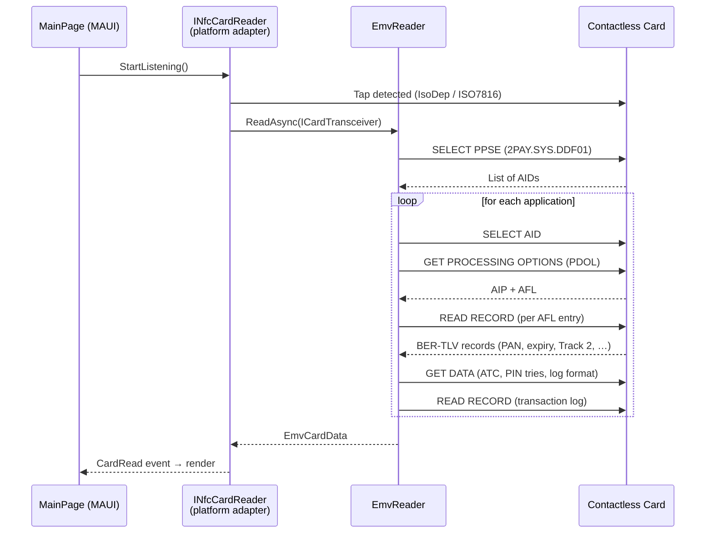

<div align="center">

# 💳 EMV Card Reader

**A cross-platform .NET MAUI app that reads the publicly available data from contactless EMV payment cards over NFC — using native platform APIs, no third-party NFC library.**

[](https://dotnet.microsoft.com/)
[](https://learn.microsoft.com/dotnet/maui/)
[](#platform-support)
[](LICENSE)

</div>

---

## Overview

The app taps a contactless EMV bank card and walks the standard terminal read flow to extract every data element the card is willing to expose to a point-of-sale terminal — PAN, expiry, cardholder name, application label, AID, scheme, the full list of BER-TLV tags, and (where present) the card's offline transaction log. It then renders all of it, plus a raw APDU trace, in a clean MAUI UI.

The whole EMV layer is platform-agnostic and sits behind a single `ICardTransceiver` abstraction. Each platform supplies a thin adapter over its native NFC stack:

- **Android** → `NfcAdapter` reader-mode + `IsoDep`
- **iOS** → CoreNFC `NFCTagReaderSession` + ISO 7816 APDUs

> No third-party NFC plugin is used — the reading is done directly against the OS NFC APIs.

---

## ⚠️ Disclaimer

This project is for **educational and research purposes only**.

- It reads **only the data a contactless card already broadcasts to any terminal** during a normal tap. **No authentication, no PIN, no CVV/CVC, and no cryptographic secrets are read or derived** — that data simply isn't exposed by the card.
- A card's PAN, expiry and (sometimes) cardholder name are sensitive personal data. **Only read cards you own or have explicit permission to read**, and handle the output responsibly.
- Use of this software must comply with your local laws and with the card scheme rules. The author accepts no liability for misuse.

---

## Features

- 🔍 **Full EMV read flow** — `SELECT PPSE` → `SELECT AID` → `GET PROCESSING OPTIONS` → `READ RECORD` (over the AFL) → `GET DATA` → transaction log.
- 🧩 **Multi-application aware** — discovers every AID advertised in the PPSE, with a fallback to a built-in list of known scheme AIDs (Visa, Mastercard, Maestro, Amex, JCB, Discover, UnionPay).
- 🏷️ **Rich decoding** — a defensive BER-TLV parser plus a decoder that turns raw tags into human-readable values: PAN formatting, dates, amounts, ISO currency/country names, Track 2 equivalent, AIP capability bits, and more.
- 🧾 **Offline transaction log** — parses the card's log entries (tag `9F4D` / `9F4F`) into structured transactions when available.
- 🛠️ **Raw APDU trace** — every command/response pair is captured and viewable, so you can see exactly what was exchanged.
- 📋 **One-tap copy** — dump everything (summary, per-tag data, warnings, APDU trace) to the clipboard as plain text.
- ♻️ **Robust APDU plumbing** — transparently handles `61xx` (`GET RESPONSE`) and `6Cxx` (wrong `Le`) status words, and brute-force record scanning when no AFL is returned.

---

## How it works



The terminal-side values needed for `GET PROCESSING OPTIONS` (PDOL) are filled with sane defaults (amount `0.01`, country/currency `840`, a random unpredictable number, etc.) — just enough to make the card respond.

---

## Platform support

| Platform | NFC reading | Notes |
|----------|:-----------:|-------|
| **Android** | ✅ | Requires NFC hardware enabled. Uses reader-mode (`NfcA`/`NfcB`, skip NDEF). |
| **iOS** | ✅ | iPhone 7+ / iOS 13+. Requires the NFC entitlement + declared AIDs (see below). |

---

## Getting started

### Prerequisites

- [.NET 10 SDK](https://dotnet.microsoft.com/download)
- The MAUI workload:
  ```bash
  dotnet workload install maui
  ```
- **Android:** a physical device with NFC (the emulator has no NFC).
- **iOS:** a physical iPhone 7 or newer, plus an Apple Developer account (the Near Field Communication Tag Reading capability is required and cannot be enabled on a free provisioning profile).

### Build

```bash
git clone https://github.com/<your-username>/emv-card-reader.git
cd emv-card-reader

# Android
dotnet build EmvCardReader/EmvCardReader.csproj -f net10.0-android

# iOS
dotnet build EmvCardReader/EmvCardReader.csproj -f net10.0-ios
```

### Run on a device

```bash
# Android (device attached via adb)
dotnet build EmvCardReader/EmvCardReader.csproj -t:Run -f net10.0-android

# iOS (open in Visual Studio / Rider, select your device, and run —
#      recommended so codesigning + provisioning are handled for you)
```

Then: launch the app → tap **Scan card** → hold a contactless bank card to the NFC antenna (back of the phone on Android, top edge on iPhone).

---

## iOS setup notes

CoreNFC will only let the app `SELECT` AIDs that are declared up front. The required configuration is already in the repo:

- **`Platforms/iOS/Entitlements.plist`** — `com.apple.developer.nfc.readersession.formats` = `TAG`.
- **`Platforms/iOS/Info.plist`** — `NFCReaderUsageDescription` (the system prompt text) and the full `com.apple.developer.nfc.readersession.iso7816.select-identifiers` list (PPSE + every scheme AID).

You still need to enable the **Near Field Communication Tag Reading** capability for your App ID in the Apple Developer portal and sign with a matching provisioning profile.

> The default `ApplicationId` in `EmvCardReader.csproj` is a placeholder (`testteem.test`) — change it to your own bundle id before signing.

---

## What gets read (and what doesn't)

**Read** (when the card exposes it): PAN, PAN sequence number, expiry & effective dates, cardholder name, application label/preferred name, AID, detected scheme, service code, issuer country, currency, Application Transaction Counter (ATC), last online ATC, PIN tries remaining, Track 2 equivalent data, the full BER-TLV tag set, and the offline transaction log.

**Not read / not possible:** the PIN, the CVV/CVC, the card's private keys, or any value that requires issuer authentication. The app performs **no** cryptographic authentication — it only requests data the EMV spec lets a terminal read in the clear.

---

## Extending it

The EMV engine is completely decoupled from the UI and the OS. To support a new platform or transport, implement two small interfaces:

```csharp
// 1. A raw APDU channel (must return the response WITH the trailing SW1/SW2)
public interface ICardTransceiver
{
    Task<byte[]> TransceiveAsync(byte[] apdu);
}

// 2. A reader surface the UI listens to
public interface INfcCardReader
{
    bool IsAvailable { get; }
    string StatusText { get; }
    void StartListening();
    void StopListening();
    event EventHandler<EmvCardData> CardRead;
    event EventHandler<string> Status;
    event EventHandler<string> Error;
}
```

Then hand your transceiver to `EmvReader.ReadAsync(...)` and raise `CardRead` with the result.

---

## License

Released under the [MIT License](LICENSE).
